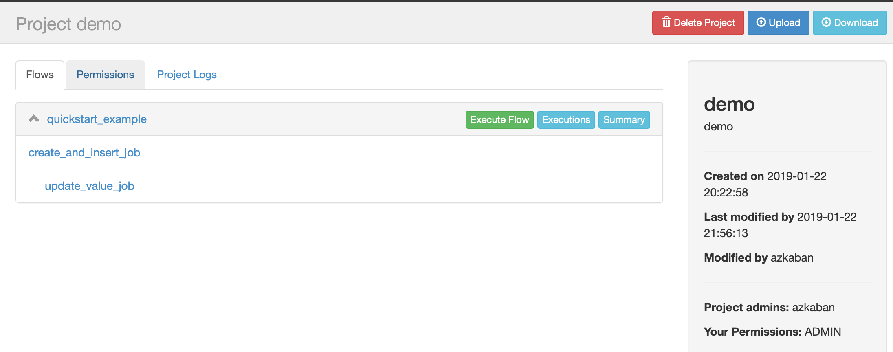
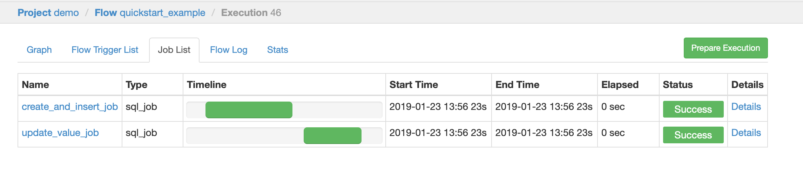
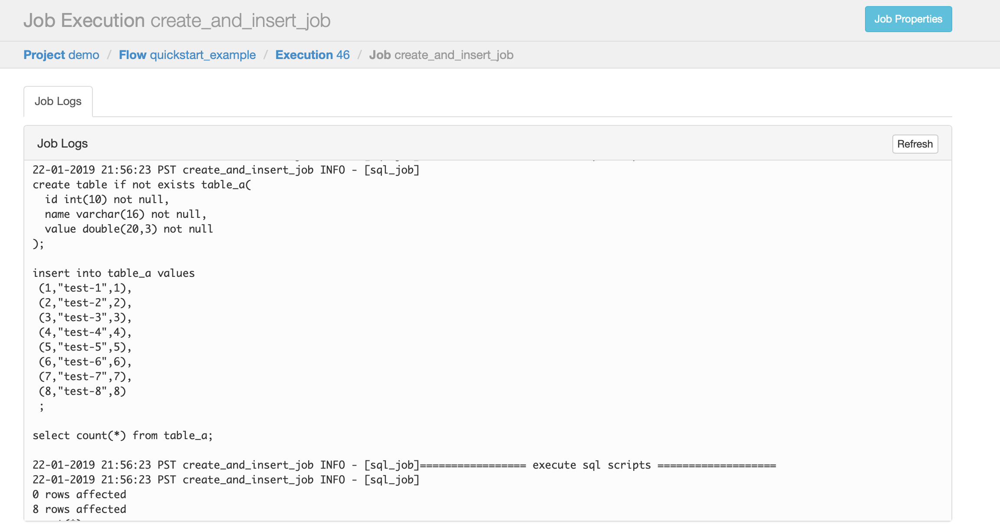

# Azkaban SQL jobtype

## 功能说明


## 安装部署
- 下载最新发行版本，如：`azkaban-plugin-jobtype-sql-1.0.1.RELEASE.zip`

下载地址：[https://gitee.com/centy/azkaban-plugin-jobtype-sql/releases](https://gitee.com/centy/azkaban-plugin-jobtype-sql/releases)

- 将`azkaban-plugin-jobtype-sql-1.0.1.RELEASE.zip`拷贝至`${AzkabanHome}/plugins/jobtypes/`目录下，直接解压到当前目录，
解压后目录结构如下：
    - plugins
        - sql_job 
            - lib
                - ant-1.10.5.jar
                - ant-launcher-1.10.5.jar
                - azkaban-plugin-jobtype-sql-1.0.1.RELEASE.jar
                - fastjson-1.2.23.jar
                - mysql-connector-java-5.1.38.jar
                - postgresql-42.2.45.jar
            - private.properties

- 重启Azkaban完成安装。

## 插件配置参数
### Flow参数
Flow参数可配置在Flow文件内，也可定义在系统环境变量、Azkaban全局参数、Azkaban控制台定义的Flow Parameter等，具体参考Azkaban的配置读取优先级。

Azkaban文档地址：[https://azkaban.readthedocs.io/en/latest/getStarted.html](https://azkaban.readthedocs.io/en/latest/getStarted.html)

参数|说明
--|--
sql_job.database.type|数据库类型，支持mysql/postgresql 
sql_job.database.driver|数据库驱动类com.mysql.jdbc.Driver
sql_job.database.host|数据库主机地址
sql_job.database.port|数据库端口
sql_job.database.database|数据库名称
sql_job.database.schema|实例或模式名称，postgresql数据库必填
sql_job.database.username|数据库用户名
sql_job.database.password|数据库密码

### Job参数
Job参数定义在Job节点内，用于配置每个Job的定义。

参数|说明
--|--
sql_job.scripts|SQL脚本路径，支持绝对路径和相对路径。相对路径是指SQL文件相对project根目录（即上传至Azkaban的zip压缩包的根目录）的路径。<br>支持多个路径，多个通过英文逗号进行分隔。

## 使用说明
**本文示例基于Azkaban Flow 2.0，对于Flow 1.0也支持。**

### 快速开始
本示例实现一个两个节点的工作流

[示例地址](job_examples/quickstart_example)

- 1.创建quickstart_example文件夹，在这个文件夹中创建`quickstart_example.flow`工作流文件。
- 2.在`quickstart_example.flow`文件中添加以下flow参数，将相关配置修改为你本地的配置：
```yaml
config: 
  sql_job.database.type: mysql # 支持mysql、postgresql
  sql_job.database.driver: com.mysql.jdbc.Driver
  sql_job.database.host: localhost
  sql_job.database.port: 3306
  sql_job.database.database: demo
  sql_job.database.schema:  # postgresql建议必填
  sql_job.database.username: root
  sql_job.database.password: xxxxxxx
```
- 3.实现第1个Job：create_and_insert_job。
    -3.1. 在quickstart_example文件夹下创建scripts文件佳，在scripts文件夹中创建一个SQL脚本文件，命名为`create_and_insert.sql`，里面通过脚本创建一个表并插入测试数据。
    ```sql
    create table if not exists table_a(
      id int(10) not null,
      name varchar(16) not null,
      value double(20,3) not null
    );
    
    insert into table_a values
     (1,"test-1",1),
     (2,"test-2",2),
     (3,"test-3",3),
     (4,"test-4",4),
     (5,"test-5",5),
     (6,"test-6",6),
     (7,"test-7",7),
     (8,"test-8",8)
     ;
    
    select count(*) from table_a;
    
    ```
    -3.2. `quickstart_example.flow`增加Job定义，JobType为"sql_job"。
    ```yaml
    config: 
      sql_job.database.type: mysql # 支持mysql、postgresql
      sql_job.database.driver: com.mysql.jdbc.Driver
      sql_job.database.host: localhost
      sql_job.database.port: 3306
      sql_job.database.database: demo
      sql_job.database.schema:  # postgresql建议必填
      sql_job.database.username: root
      sql_job.database.password: 123456
    
    nodes:
      - name: create_and_insert_job
        type: sql_job
        config:
          sql_job.scripts: quickstart_example/scripts/create_and_insert.sql # 脚本路径
    ```
- 4.实现第2个Job：create_and_insert_job。
    -4.1. 同3.1,在scripts文件夹中创建一个SQL脚本文件，命名为`create_and_insert.sql`，里面通过脚本创建一个表并插入测试数据。
    ```sql
    update table_a set value = value*2;
    
    select count(*) from table_a;

    ```
    -4.2. `quickstart_example.flow`增加Job定义，JobType为"sql_job"。
    ```yaml
    config: 
      sql_job.database.type: mysql # 支持mysql、postgresql
      sql_job.database.driver: com.mysql.jdbc.Driver
      sql_job.database.host: localhost
      sql_job.database.port: 3306
      sql_job.database.database: demo
      sql_job.database.schema:  # postgresql建议必填
      sql_job.database.username: root
      sql_job.database.password: 123456
    
    nodes:
      - name: create_and_insert_job
        type: sql_job
        config:
          sql_job.scripts: quickstart_example/scripts/create_and_insert.sql # 脚本路径
      - name: update_value_job
        type: sql_job
        dependsOn:
        - create_and_insert_job
        config:
          sql_job.scripts: quickstart_example/scripts/update_value.sql # 脚本路径
    ```
    
- 5.将quickstart_example打包成zip包，上传Azkaban的project中，上传成功后如下图。


- 6.执行工作流，结果如下图。



### 占位符参数
本插件实现SQL脚本的占位符替换，实现原理如下：
- SQL脚本中通过"${<parameterName>}"使用占位符参数，其中parameterName命名格式为："sql_job.<自定义参数名>[.<自定义参数名2>]"
- 可在Azkaban配置中增加parameterName参数配置，配置参数位置可以是环境变量、全局参数、Flow参数、甚至Job参数均可，具体可参考Azkaban配置读取逻辑。
- 插件在执行SQL脚本前，先从Azkaban的配置参数获取对应的配置值，替换SQL脚本中的占位符参数，再执行脚本。

约束条件：
- 占位参数命名必须严格按照要求。

#### 使用示例

[示例地址](job_examples/replace_parameter_example)

- 1.参照上面示例，将sql脚本文件进行修改，表名都使用占位符`${sql_job.tableName}`替换，如下：
**create_and_insert.sql**
```sql
create table if not exists ${sql_job.tableName}(
  id int(10) not null,
  name varchar(16) not null,
  value double(20,3) not null
);

insert into ${sql_job.tableName} values
 (1,"test-1",1),
 (2,"test-2",2),
 (3,"test-3",3),
 (4,"test-4",4),
 (5,"test-5",5),
 (6,"test-6",6),
 (7,"test-7",7),
 (8,"test-8",8)
 ;

select count(*) from ${sql_job.tableName};

```
**update_value.sql**
```sql
update ${sql_job.tableName} set value = value*2;

select count(*) from ${sql_job.tableName};

```

- 2.在`quickstart_example.flow`中增加占位符参数定义，如下：
```yaml
config: 
  sql_job.database.type: mysql # 支持mysql、postgresql
  sql_job.database.driver: com.mysql.jdbc.Driver
  sql_job.database.host: localhost
  sql_job.database.port: 3306
  sql_job.database.database: demo
  sql_job.database.schema:  # postgresql建议必填
  sql_job.database.username: root
  sql_job.database.password: 123456
  sql_job.tableName: table_b #增加该占位符变量定义

nodes:
  - name: create_and_insert_job
    type: sql_job
    config:
      sql_job.scripts: quickstart_example/scripts/create_and_insert.sql # 脚本路径
  - name: update_value_job
    type: sql_job
    dependsOn:
    - create_and_insert_job
    config:
      sql_job.scripts: quickstart_example/scripts/update_value.sql # 脚本路径
```

- 3.上传Azkaban执行同上面示例。

## 注意事项
- sql解释执行使用ant.jar包，该包不支持"#"号格式的注释，只支持"--"或"//"格式注释。
- 占位符参数名必须以"sql_job."作为前缀。

